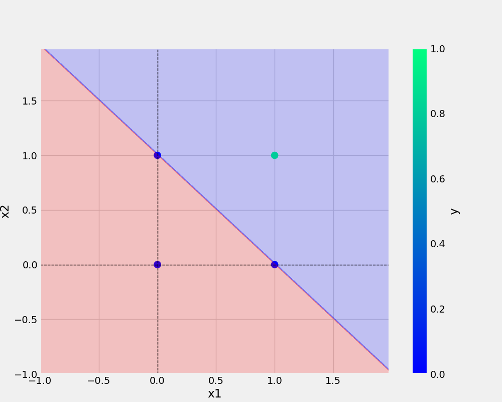
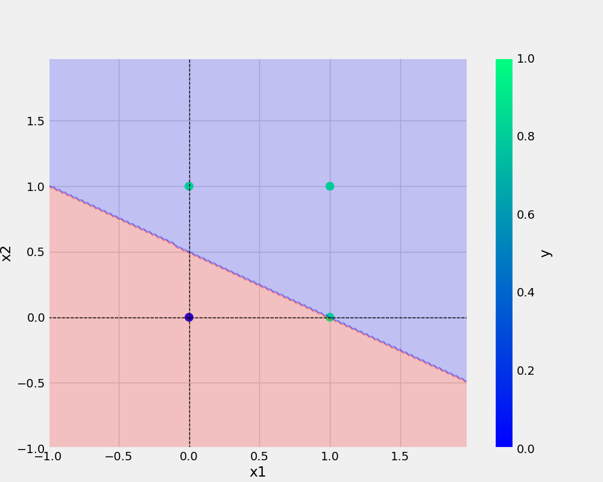
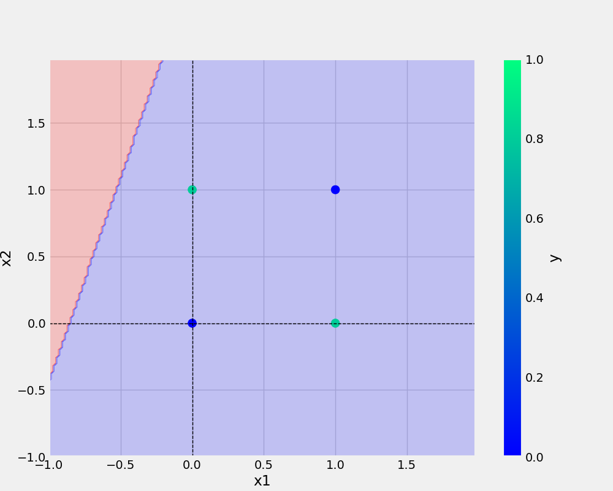

# Perceptron
Perceptron Implementation

In this project we have implemented a single Neuron and trained it with different gates.

###AND 
x1 |x2 |Expected Output
-|-|-
0|0|0
0|1|0
1|0|0
1|1|1
####Actual Prediction

###OR 
x1 |x2 |Expected Output
-|-|-
0|0|0
0|1|1
1|0|1
1|1|1
####Actual Prediction

###XOR
x1 |x2 |Expected Output
-|-|-
0|0|0
0|1|1
1|0|1
1|1|0
####Actual Prediction

##Conclusion

Single Neuron understood or learned well the AND, OR gates but failed to do the correct prediction for XOR logic, hence we need multi layer Nural Network for understanding complex logic.