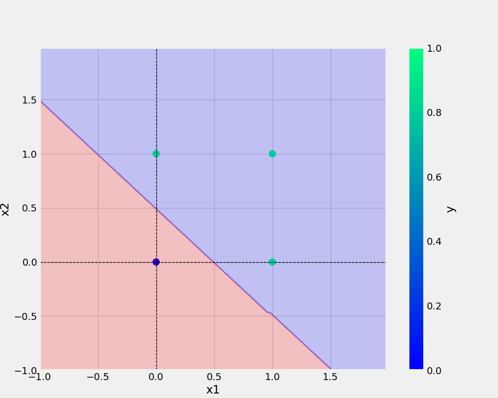

# Perceptron
Perceptron Implementation

In this project we have implemented a single Neuron and trained it with different gates.

## Perceptron Details
* Input Nodes : 2
* Output Node : 1
* Activation Function: Step
* Optimizer : Gradient Descent
* Eta : 0.3
* Epochs : 10

### Evaluation Metric
Error = y-y_hat
where
y_hat = Predicted Output

### Weight Updation
W := W + Eta * x' * Error
where
Eta = Learning Rate


## Training and Prediction
### AND 

x1 |x2 |Expected Output
-|-|-
0|0|0
0|1|0
1|0|0
1|1|1

#### Actual Prediction


### OR 

x1 |x2 |Expected Output
-|-|-
0|0|0
0|1|1
1|0|1
1|1|1

#### Actual Prediction

### XOR

x1 |x2 |Expected Output
-|-|-
0|0|0
0|1|1
1|0|1
1|1|0

#### Actual Prediction


## Conclusion

Single Neuron understood or learned well the AND, OR gates but failed to do the correct prediction for XOR logic, hence we need multi layer Nural Network for understanding complex logic.

## Python code

```python
def main(data, modelName, plotName, eta, epochs):
    df = pd.DataFrame(data)
    print(df)
    X, y = prepare_data(df)
    model = Perceptron(eta=eta, epochs=epochs)
    model.fit(X, y)
    _ = model.total_loss()
    save_model(model, filename=modelName)
    save_plot(df, plotName, model)
```


